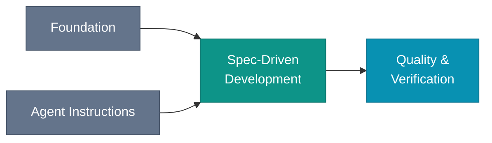

# Overview

The agent does not know your decisions. Intent Engineering puts decisions, change-sized specs, and verification in the workspace. The agent then has less to infer from code or conversation history.

*Context comes first. Intent directs the change. Evidence checks the result.*

## The four practices

| Practice | What it does | What breaks without it |
|---|---|---|
| [Foundation](/foundation/) | Decisions, design docs, specs, and an index the agent can load | The agent guesses from public patterns instead of your codebase |
| [Agent Instructions](/agent-instructions/) | One entry point and one instruction hub for each session | Each session re-derives conventions from scratch |
| [Spec-Driven Development](/spec-driven/) | A change-sized spec written before code and archived after merge | The change ships without a settled target |
| [Quality & Verification](/quality/) | Tests that trace back to acceptance criteria in the spec | The target exists, but nothing verifies the change hit it |

[Team Workflows](/team/) covers how the same practices hold up across a team.

This is broader than prompt engineering. A prompt shapes one exchange. Intent Engineering changes the maintained inputs, the implementation target, and the review path across many sessions.

## How a session works

*You write the spec. The agent reads context and spec, then generates code and tests. The tests show whether the spec was met.*

## Is this for you?

This book assumes you:

- ship production code and treat human review as non-negotiable
- already use a capability-class coding agent: reasoning-capable model, real tool use, enough autonomy to carry a plan across a session
- work on a codebase that outlives the session that started it
- want consistency across sessions, not only speed within one

Throwaway scripts, exploratory prototypes, and completion-only tools do not need the full discipline. [The Introduction](/introduction#when-a-project-earns-this) defines the boundary, and [Honest Maturity](/appendices/honest-maturity) explains how to adopt only the practices worth their upkeep.

## Where to start

| If you want to… | Start here |
|---|---|
| Understand the motivation first | [Preface](/preface), then [The Human-Agent Engineering Mindset](/mindset), then [Introduction](/introduction) |
| Get into the practice immediately | [Foundation](/foundation/) |
| See what the practices look like in code | [Companion Repo](/appendices/companion-repo) |
| Evaluate whether to adopt at all | [Honest Maturity](/appendices/honest-maturity) |
